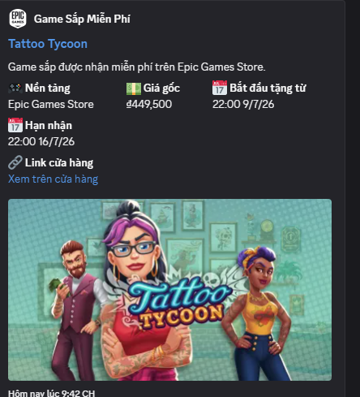

<h1 align="center">
  
</h1>

<p align="center">
  
  
  
  
  
</p>


[English](README.en.md) | [Tiếng Việt](README.vi.md)

A free Discord bot that posts **free games**, **sale events**, and **deep discount deals** from **Epic Games Store** and **Steam**.



It uses **Discord Webhooks** and **GitHub Actions**, so you do not need a VPS, database, Discord bot token, `discord.js`, or a bot running 24/7.

## Project Info

| Item | Value |
| --- | --- |
| Author | Huỳnh Tấn Đạt |
| Source language | JavaScript |
| Runtime | Node.js |
| Module style | CommonJS |
| Automation | GitHub Actions |
| Discord integration | Discord Webhook |

## Is It Free?

With the default setup: **yes, it is free**.

| Component | Cost |
| --- | --- |
| Discord Webhook | Free |
| Node.js | Free |
| Public GitHub repository | Free |
| GitHub Actions twice per day | Free within GitHub limits |
| VPS/database/proxy | Not required |

The default schedule runs every 12 hours and is lightweight. For personal use or a small Discord server, this is effectively **$0**.

## How It Works

```txt
GitHub Actions runs every 12 hours
        ↓
Node.js checks Epic + Steam
        ↓
Filters free games, sale events, and deep discounts
        ↓
Sends Discord embeds through webhooks
        ↓
Updates sent.json to avoid duplicate alerts
```

## Features

- Epic Games Store free game alerts.
- Steam deal alerts.
- Sale event alerts, such as `Steam Summer Sale`.
- Separate Discord webhooks for Epic and Steam.
- Discord embeds with Steam/Epic logos, game images, and event banners when available.
- Duplicate prevention through `src/storage/sent.json`.
- Free scheduled automation through GitHub Actions.
- Safe for public repositories because webhooks are stored in GitHub Secrets.

## Requirements

For local usage:

- Node.js LTS
- Git
- GitHub account
- Discord server with permission to create Webhooks

If you only want scheduled automation, you still need Git to push the source code to GitHub.

## Step 1: Create Discord Channels

Create two Discord channels, for example:

```txt
#epic-alert
#steam-alert
```

You can use one shared channel, but separate channels are easier to read.

## Step 2: Create Discord Webhooks

For each channel:

1. Open `Edit Channel`.
2. Go to `Integrations`.
3. Open `Webhooks`.
4. Click `New Webhook`.
5. Name it, for example `Epic Game Alert` or `Steam Game Alert`.
6. Click `Copy Webhook URL`.

Recommended channel permissions:

```txt
View Channel
Send Messages
Embed Links
Read Message History
Attach Files
```

You do not need to grant `Manage Webhooks` to `@everyone`.

## Step 3: Run Locally

Install dependencies:

```bash
npm install
```

Create `.env` from `.env.example`:

```env
DISCORD_WEBHOOK_URL=optional_fallback_webhook_here
EPIC_DISCORD_WEBHOOK_URL=your_epic_webhook_here
STEAM_DISCORD_WEBHOOK_URL=your_steam_webhook_here
SALE_ALERTS_ENABLED=true
ENABLE_EPIC=true
ENABLE_STEAM=true
ENABLE_FREE_ALERTS=true
ENABLE_EVENT_ALERTS=true
MIN_SALE_DISCOUNT_PERCENT=80
MAX_SALE_ALERTS_PER_PLATFORM=5
```

### Environment Variables

| Variable | Required | Used in | Meaning |
| --- | --- | --- | --- |
| `EPIC_DISCORD_WEBHOOK_URL` | Yes | Local `.env` + GitHub Secrets | Epic channel webhook |
| `STEAM_DISCORD_WEBHOOK_URL` | Yes | Local `.env` + GitHub Secrets | Steam channel webhook |
| `GOG_DISCORD_WEBHOOK_URL` | No | Local `.env` + GitHub Secrets | GOG channel webhook (falls back to default webhook if empty) |
| `DISCORD_WEBHOOK_URL` | No | Local `.env` + GitHub Secrets | Fallback webhook if you do not split channels |
| `SALE_ALERTS_ENABLED` | No | Local `.env` + GitHub Secrets/Variables | Enable sale alerts, default `true` |
| `ENABLE_EPIC` | No | Local `.env` + GitHub Secrets/Variables | Enable Epic checks, default `true` |
| `ENABLE_STEAM` | No | Local `.env` + GitHub Secrets/Variables | Enable Steam checks, default `true` |
| `ENABLE_GOG` | No | Local `.env` + GitHub Secrets/Variables | Enable GOG checks, default `true` |
| `ENABLE_FREE_ALERTS` | No | Local `.env` + GitHub Secrets/Variables | Enable free game alerts, default `true` |
| `ENABLE_UPCOMING_ALERTS` | No | Local `.env` + GitHub Secrets/Variables | Enable Epic upcoming free game alerts, default `true` |
| `ENABLE_EVENT_ALERTS` | No | Local `.env` + GitHub Secrets/Variables | Enable sale event alerts, default `true` |
| `MIN_SALE_DISCOUNT_PERCENT` | No | Local `.env` + GitHub Secrets/Variables | Minimum sale discount, default `80` |
| `MAX_SALE_ALERTS_PER_PLATFORM` | No | Local `.env` + GitHub Secrets/Variables | Max deals per platform, default `5` |
| `STEAM_PAGES_TO_SCAN` | No | Local `.env` + GitHub Secrets/Variables | Number of Steam search pages to scan (50 games/page), default `3` |
| `MAX_SALE_PRICE` | No | Local `.env` + GitHub Secrets/Variables | Maximum price limit for sale alerts (e.g. `150000` VNĐ), default unlimited |
| `PREFERRED_GENRES` | No | Local `.env` + GitHub Secrets/Variables | Preferred game genres to receive (e.g. `Action, RPG`), default all |
| `EXCLUDED_GENRES` | No | Local `.env` + GitHub Secrets/Variables | Excluded game genres to ignore (e.g. `Hentai, Anime`), default none |
| `MESSAGE_LOCALE` | No | Local `.env` + GitHub Secrets/Variables | Language for Discord Embeds and logs (`vi` or `en`), default `vi` |
| `DISCORD_MENTION_ROLE` | No | Local `.env` + GitHub Secrets/Variables | Discord role to ping (e.g. `@everyone`, `@here`, or `<@&id_role>`), default none |

Preview what the bot finds without sending Discord messages:

```bash
npm run dry-run
```

Send real Discord alerts:

```bash
npm start
```

Run tests:

```bash
npm test
```

## Step 4: Free Scheduled Deployment With GitHub Actions

Push the source code to a public or private GitHub repository.

Then open:

```txt
Settings
-> Secrets and variables
-> Actions
-> New repository secret
```

Create these secrets:

```txt
EPIC_DISCORD_WEBHOOK_URL
STEAM_DISCORD_WEBHOOK_URL
```

Paste the Epic webhook into `EPIC_DISCORD_WEBHOOK_URL`.

Paste the Steam webhook into `STEAM_DISCORD_WEBHOOK_URL`.

Run it manually:

```txt
Actions
-> Check Free Games
-> Run workflow
```

Default schedule:

```txt
00:00 UTC
12:00 UTC
```

## Sale Configuration

Default:

```env
MIN_SALE_DISCOUNT_PERCENT=80
MAX_SALE_ALERTS_PER_PLATFORM=5
```

Meaning:

```txt
Only send deals with at least 80% discount.
Send at most 5 deals per platform per run.
```

To send more deals:

```env
MIN_SALE_DISCOUNT_PERCENT=70
MAX_SALE_ALERTS_PER_PLATFORM=10
```

Avoid setting the threshold too low, or your Discord channel may get spammed.

## Local vs Deployment

| Mode | Use case | Automatic? |
| --- | --- | --- |
| `npm run dry-run` | Preview data | No |
| `npm start` | Run once on your machine | No |
| GitHub Actions | Free scheduled deployment | Yes, every 12 hours |

If your computer is off, local mode does not run. Use GitHub Actions for free scheduled automation.

## Project Structure

```txt
src/
├─ services/
│  ├─ discord.service.js
│  ├─ epic.service.js
│  ├─ event.service.js
│  └─ steam.service.js
├─ storage/
│  ├─ sent.json
│  └─ sent.storage.js
├─ assets/icons/
└─ index.js

.github/workflows/check-free-games.yml
```

## Security

- Do not commit `.env`.
- Discord webhook URLs are secrets.
- Use GitHub Secrets for deployment.
- If a webhook leaks, regenerate it in Discord.

## Data Sources

- Epic: public Epic Games Store endpoint.
- Steam: public Steam Store search/specials.
- Steam events: configured in `src/services/event.service.js`.
- Steam/Epic logos: Simple Icons, built into local PNG files.
- Fallback icons: Google Fonts Icons, built into local PNG files.

## Useful Commands

```bash
npm run build-icons
npm run dry-run
npm test
npm start
```

## FAQ

### Why did the bot send nothing?

There may be no new games or deals, or the current items already exist in `src/storage/sent.json`.

### Does it run if my PC is off?

Local mode does not. GitHub Actions does, because it runs on GitHub's infrastructure.

### Can I use one Discord channel only?

Yes. Set only `DISCORD_WEBHOOK_URL`, or set the same webhook URL for Epic and Steam.

### How do I change how many Steam pages are scanned?
Configure the `STEAM_PAGES_TO_SCAN` environment variable in your `.env` or GitHub Variables. Default is `3` (scans ~150 games).

### How does the network retry mechanism work?
When the bot faces network outages or is rate-limited by Discord/Steam/Epic, it automatically pauses and retries up to 3 times with exponential backoff. It automatically waits for the duration specified in Discord's `retry-after` header when rate limit 429 happens.

### What information is stored in the sent history?
The `src/storage/sent.json` file now logs more details including: `id` (game ID), `title` (game name or event title), `platform` (Steam/Epic), and `sentAt` (timestamp). The new format is fully backward compatible with the older ID-only string array format. Deals and events older than 30 days are automatically deleted to optimize file space.

### How to tag/ping server roles when a new game drops?
Assign `@everyone`, `@here`, or a specific role tag `<@&YOUR_ROLE_ID>` to the `DISCORD_MENTION_ROLE` environment variable. The bot will automatically send the mention along with the game embed.

### How to change the bot's language?
Set `MESSAGE_LOCALE=en` (or `vi` for Vietnamese) in your environment variables. This localizes both the Discord embeds and the CLI console logs.

### How does message batching work?
To keep Discord channels clean during sales, the bot batches discount deals (`sale`) from the same platform (Steam/Epic) into **a single Discord message with up to 10 Embeds**. Free games, upcoming games, and sale events are still sent as standalone messages for visibility.

### Does the bot support GOG.com free games?
Yes! The bot scans GOG.com catalog for free games. GOG support can be toggled using `ENABLE_GOG`, and you can configure a separate webhook using `GOG_DISCORD_WEBHOOK_URL`.

### How can I filter deals by price and genre?
You can customize your feed by setting the following environment variables:
* `MAX_SALE_PRICE`: Maximum price to receive alerts for sale deals (e.g. `150000` VNĐ).
* `PREFERRED_GENRES`: Preferred game categories (e.g. `Action, RPG`) to restrict alerts to specific tags.
* `EXCLUDED_GENRES`: Genre tags to exclude from alerts (e.g. `Casual, Sports`).


### Are Steam ratings displayed?
Yes! The bot parses user review summaries (e.g., *Very Positive (88%)*) directly from Steam's search results and displays them as a field in the Discord embed.


## Creating Release Tag v1.0.0
To mark your repository with the official `v1.0.0` stable release version, run the following commands in your local shell:

```bash
# Tag the release locally
git tag -a v1.0.0 -m "Release v1.0.0 - Network retry & feature upgrades"

# Push the tag to GitHub
git push origin v1.0.0
```
Or you can go to GitHub web interface, click **Releases** -> **Draft a new release**, type `v1.0.0` as the tag name, and publish the release.


## Support & Custom Bot Requests

If you want to support the project or request a custom Discord bot, contact the author:

- Author: **Huỳnh Tấn Đạt**
- Facebook: [tan.dat.551987](https://www.facebook.com/tan.dat.551987)

Donation QR:


